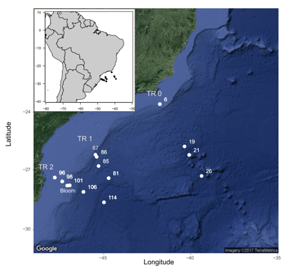
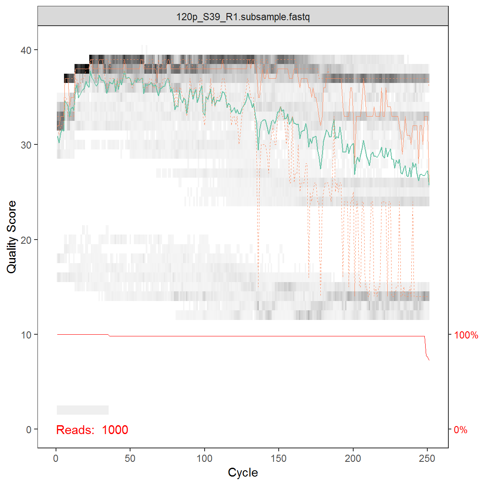
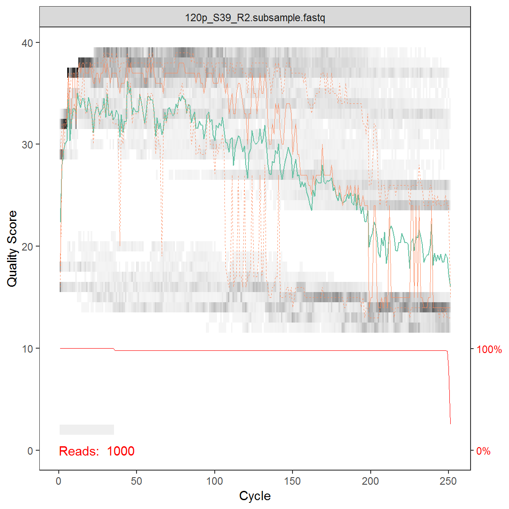
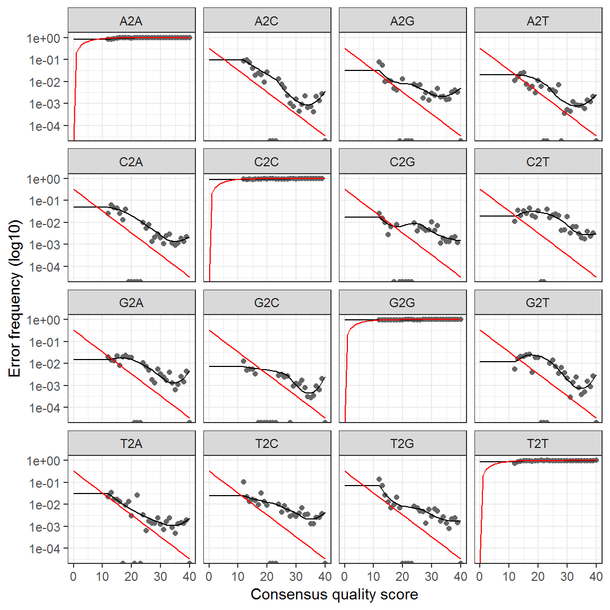
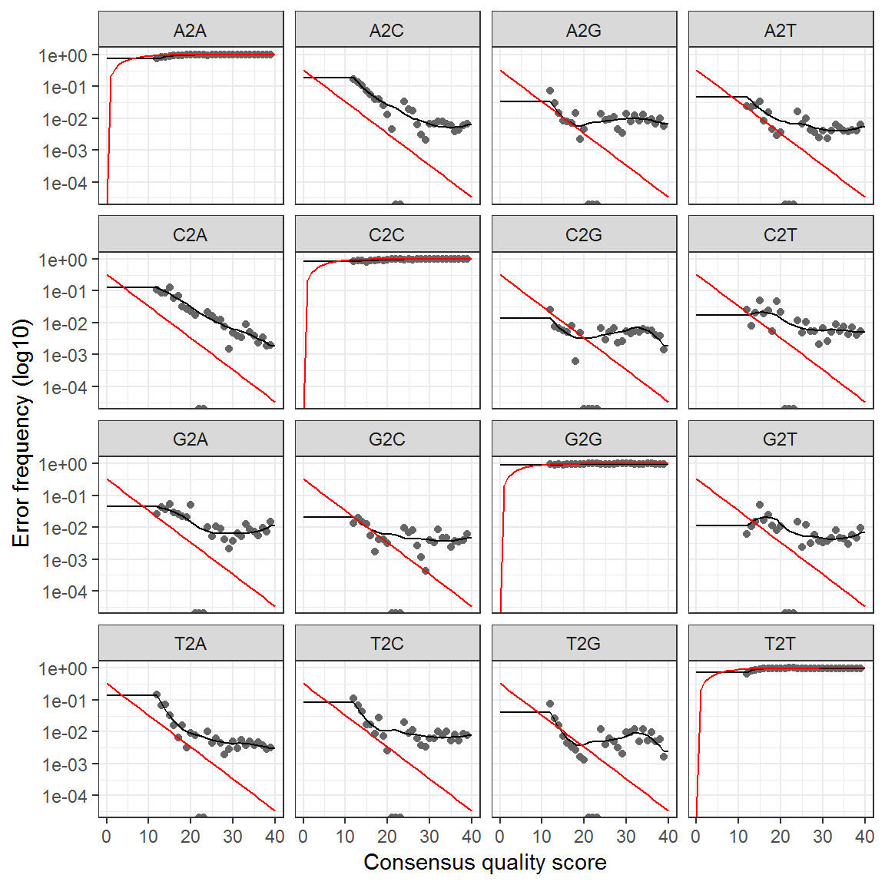
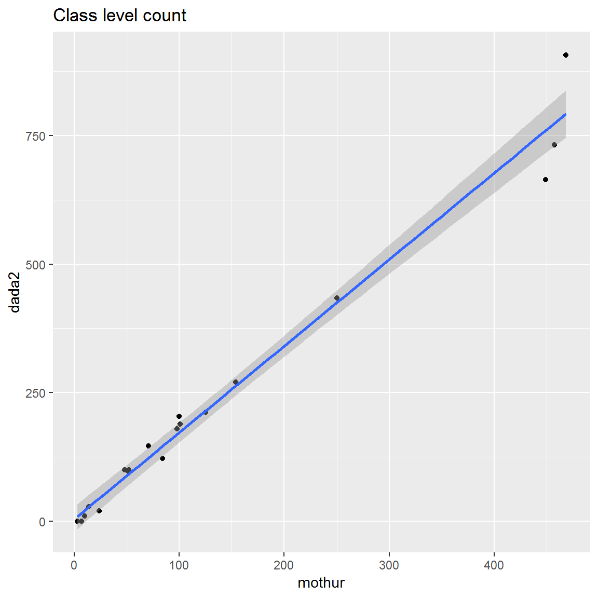
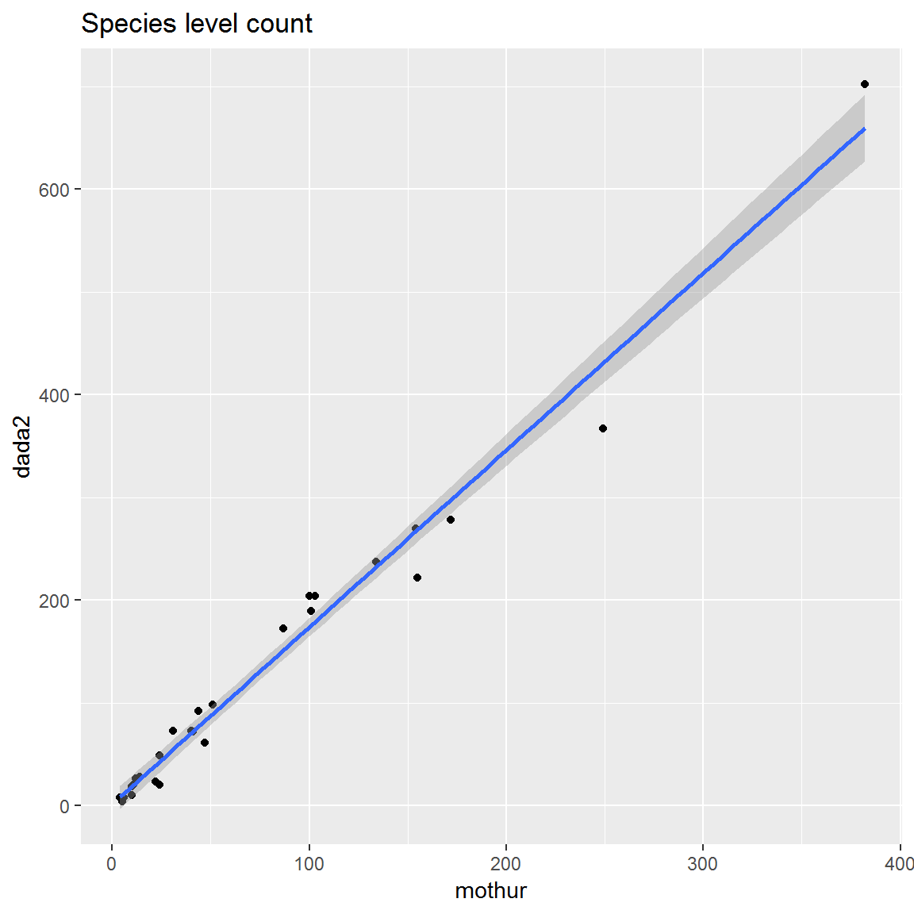

```{r setup, include=FALSE}
knitr::opts_chunk$set(echo = FALSE, message = FALSE, warning = FALSE, cache = TRUE,
                      fig.align = 'center')
```

```{r}
# Latex notes
# classoption:table in the YAML header to allow the striped option for tables
# classoption: t  to avoid centering the slides
# https://tex.stackexchange.com/questions/9889/positioning-content-at-the-top-of-a-beamer-slide-by-default
# https://stackoverflow.com/questions/47171585/change-paper-size-and-orientation-in-an-rmarkdown-pdf
# For complex animations, better to use Latex (see updating part)
```

```{r}
  library("dada2")
  library("phyloseq") 
  library("Biostrings")
  
  library("ggplot2")

  library("dplyr")
  library("tidyr")
  library("tibble")

  library("readxl")
  library("readr")

  library("stringr")

  library("kableExtra") # necessary for nice table formatting with knitr
   
```

```{r}
# Define a function for formatting the dataframes

 my_kable <- function(df){
   options(knitr.kable.NA = '') 
   kable(df,"latex",row.names =FALSE, booktabs=T, linesep = "") %>%
      kable_styling(latex_options = c("scale_down", "striped"))
   }
```

# Data used


\begin{columns}
\begin{column}{0.5\textwidth}

\begin{itemize}
	\item The samples originate from the CARBOM cruise (2013) off Brazil (Ribeiro et al. 2018). 
	\item Samples have been sorted by flow cytometry and 3 genes have been PCR amplified :  
	\begin{itemize}
      \item 18S rRNA - V4 region
      \item 16S rNA with plastid
      \item  nifH 
  \end{itemize}
  \item The PCR products have been sequenced by 1 run of Illumina 2*250 bp.  
  \item The data consist of the picoplankton samples from one transect and fastq files have been subsampled with 1000 sequences per sample. 
\end{itemize}
\end{column}

\begin{column}{0.5\textwidth}
```{r , out.width='1\\textwidth', fig.align="center", echo=FALSE}

```
\end{column}

\end{columns}


# Inspect and process raw sequences

* Construct a list of the fastq files
* Get sequences per file
* Plot quality

{ width=50% }
{ width=50% }

* Remove primers
    - dada2 by length
    - cutadapt by sequence

# Dada2

* Learn error rates

{ width=40% }
{ width=40% }```

* Dereplicate reads
* Sequence-variant inference algorithm to the dereplicated data (the heart of dada2)
* Merge pairs
* Remove chimeras de-novo
* Assign taxonomy with Wang classifier
    - For euks use PR2 database
    - Provide taxonomy and bootstrap
* Filter out sequences that have bootstrap < 80 at higher taxonomic level

# Compare mothur vs dada2

* Class level
* Species level


{ width=50% }
{ width=50% }
      

# Now

\vfill
\begin{center}
 {\LARGE Let us do it !}
\end{center}
\vfill

